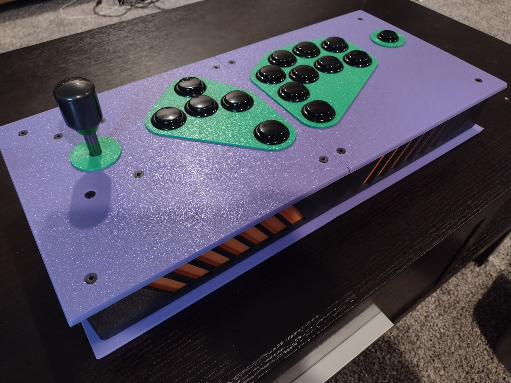

# The Buildable Stick System

Files for 3D printing an arcade stick.

Have you ever wanted to conjure your own arcade stick out of the ether (well, plastic), or to prototype a new layout or
design before sending it to a custom builder? Do you just love having your space filled with arcade stick enclosures,
because you keep making different variants, colorways, and so on? Or do you simply want a good stick on the cheap, and
know someone or a library with a 3D printer? The Buildable Stick System may be the project for you!

**Join the project IRC channel: [#buildable-stick-system @
Randomus](https://webirc.randomus.net/#buildable-stick-system)!**

[OpenSCAD-based illustration of how the components for an overhang panel-based stick fit together.]

[Photo of a completed inset panel-based stick.]

Originally an attempt to make a couple customized STL files for the [OpenStickCommunity Fightstick
Case](https://github.com/OpenStickCommunity/Hardware/tree/main/Fightstick%20Case), the changes ballooned to fit my
design and became incompatible with that project's components. This should be considered a different project with some
similar DNA, but to stress again, it could not have been done without that project as a guide star. See **Attribution**.

## Designing

No particular arcade stick design is prescribed by this project, instead, SCAD files are provided to choose desired
component objects or create new ones. The OpenSCAD language is essentially a functional programming language, making it
it easy to reuse, alter, and compose objects. If you do not see the object you would like, you can likely create it by
starting with an existing object and constructing what you'd like with new or existing components.

## Usage of Parts

There are a lot of parts to pick from, but there are some structural variants to pay attention to; here's some help
about what the types of parts are and how to use them:

* `frames/`
    * `complete/` --- these are the four walls of the frame as one piece, in a couple variations for combining into
      larger arcade sticks. They are simple to assemble, but you have fewer modularity/customization options, and they
      are harder to print because the physics of the material cooling will probably pull the corners up. They also need
      supports, since the top and bottom of the frame both have trays for panels to go into. Use at your own risk.
    * `pieces/` these are the same four walls (generally speaking) as in the complete frames above, broken out into
      modular pieces to print separately. Because they are separate pieces, you can mix and match colors, and you can
      lay them all face down on the print surface for better adhesion and surface patterns. There are also variants
      here, the "windowed" pieces, for doing two-tone variants and that kind of thing. There are also frame walls pulled
      out to create MCZ TE-style extended sides. There is an interconnect that stands in for the joined inner wall
      between boxes of the overall unit. You need this if you are combining multiple sets of walls, e.g. for a
      two-panel-long stick.
* `panels/`
    * `inset/` --- various panels, all of the same size, that fit into and flush with the frame, making the arcade stick
      top or bottom. Aside from using up a bit of the space for components inside the frame, come with no downsides ---
      they print easily and are a pretty simple shape to tweak and remix.
    * `overhang/` --- overhang panels have their plane extending over the edge of the frame, creating a bit of a
      sandwich look. This is mostly an aesthetic choice, but they sit higher in the frame as well, the main panel being
      over/under the frame rather than within it. This extra space is useful for taller levers. The only downside to
      these is that they aren't as reusable as the inset panels, since the inset panels can go anywhere, but the
      overhang panels must be designed to not overlap with other overhang panels, so you might have to make more custom
      variants depending on where you put things.
* `misc/`
    * Pieces that I haven't organized better (yet) --- there are decorative plates for top buttons and similar to give
      more color variance and some layers to the arcade stick, some very simple dustwashers, plates that fit rocker
      switches and the like in Neutrik D or 20mm holes, and a lever mount spacer for getting your lever shaft at the
      desired height. You don't *need* any of these, but you'll probably use a few.
* `extras/`
    * Various experiments and things not directly related to making an arcade stick. At time of writing, there's a
      couple pieces for a little stand for the stick, solely for vanity purposes.
        * `bss-ae/` --- these are pieces for an arcade control panel that fits on the Qanba 2009. See the docs in that
          directory for details.

Feel free to request or contribute to more objects. Additional documentation regarding assembling the stick is available
in `docs/assembly-and-tips.md`.

## Printing

These items all fit on a 256mm^2 print bed; I use a Bambu Lab P1P based on what I've learned from the
OpenStickCommunity. Standard settings seem sufficiently sturdy, but see `docs/printing-and-materials.md` for more
thoughts and settings based on my tinkering with prints.

## Assembling

What you'll need beyond these objects:

* An arcade stick board (I recommend [TheTrain's RP2040 Advanced Breakout
  Board](https://github.com/OpenStickCommunity/Hardware/tree/main/RP2040%20Advanced%20Breakout%20Board))
    * 4 M3 8mm hex bolts to secure the PCB to a panel
* Per frame and panel combo:
    * 4 45mm M4 hex brass standoffs (or equivalent)
    * 8 M4 countersunk hex bolts
        * Overhang panels should use 12-16mm length bolts since they are taller
        * Inset panels should probably use 8-12mm bolts --- some standoffs aren't threaded the whole way, making 16mm
          too long to go flush
        * If making the 45mm standoffs from multiple smaller ones, make sure they have enough length to take your bolts!
* Per frame connection point (only necessary if you are using complete frames and not frame pieces):
    * 8 16mm M4 bolts
    * 8 M4 flange nuts
* For a lever:
    * 4 12-16mm M4 countersunk hex bolts
    * 4 M4 flange nuts
* For Neutrik D connections:
    * 2 10mm M3 hex bolts
    * 2 M3 flange nuts
* Buttons and levers as desired
* Wiring as required

## Rough Costs

This is a rough estimate of the cost to produce one of these sticks, assuming a usual 2-frame design and layout.
Filament masses from Bambu Studio estimates, using Bambu PLA Basic, 20% gyroid infill and 3 wall loops.

* Left and right frame: **$10.42 USD** (208.50g each, as of 2024-02-22)
* Left and right (inset) top panels: **~$6.40 USD** (~128g each, as of 2024-02-22)
* Left and right (non-overhang) bottom panels: **$6.80 USD** (135.99g each, as of 2024-02-22)
* Miscellaneous mounting plates, decorative plates, etc.: **~$1.83 USD** (~73g, as of 2024-02-22)
* 8 16mm M4 bolts to connect the frames: **$0.72 USD** (you can get a pack of 100 on Amazon for $9, as of 2023-09-12)
    * These are only necessary if you are using the whole frames, but as a heads up, the material cost of the
      pieces-based interconnect piece costs around $1, so it's roughly a wash since that's also a frame wall.
* 8 M4 flange nuts to connect the frames: **$0.68 USD** (you can get a pack of 100 on Amazon for $8.50, as of 2023-09-12)
* 4 10mm M3 bolts to connect Neutrik D plates to frames: **$0.40 USD** (you can get a pack of 100 on Amazon for $10, as
  of 2023-09-12)
* 4 M3 flange nuts to connect Neutrik D plates to frames: **$0.34 USD** (you can get a pack of 100 on Amazon for $8.50,
  as of 2023-09-12)
* 8 45mm M4 standoffs to connect panels to frames: **$2.40 USD** (you can get a pack of 10 on AliExpress for $3, as of
  2023-09-12)
    * You could 3D print these too, but you're probably better off with brass ones as they give some weight to the
      stick anyway
    * You can also use a shorter length with longer bolts, or combine multiple standoffs, if either of those yield better
      prices
* 8 16mm M4 bolts to connect top panels to frames: **$0.72 USD** (you can get a pack of 100 on Amazon for $9, as of
* 8 12mm M4 bolts to connect bottom panels to frames: **$0.72 USD** (you can get a pack of 100 on Amazon for $9, as of
  2023-09-12)

With an enclosure coming in around $31, depending on your choices --- say, ~$30 for TheTrain's RP2040 Advanced Breakout
Board, ~$60 for Sanwa buttons and a lever, and ~$20 for miscellaneous connectors and wiring --- you can put a
full-featured controller with an open source foundation together for around $140. Reducing wall and infill settings
will probably save you around $5 of material, and you can probably decide what you want to do from there.

## Miscellany

See the `/docs/` directory for more thoughts too scattered for this document.

## Issues and Limitations

This is a living repository, and as such, there are likely issues with the objects, known or otherwise.
These issues may be fixed in the future; see `TODO.md` for details.

## Development and Contributing

Improvements, variants, new layouts, novel ideas, and etc. are all welcome.

These files are suitable for previewing and rendering in OpenSCAD. They may also work in FreeCAD and perhaps other
software, but they are developed in OpenSCAD, so YMMV otherwise.

This project is hosted at [my personal Git site](https://git.incorporeal.org/bss/buildable-stick-system), but people are
more likely to want to interact with [the GitHub mirror](https://github.com/bsstephan/buildable-stick-system). Feel free
to use either.

I'm reachable on the fediverse, over email, or on Discord, but if you're looking for an option I prefer, I maintain an
IRC channel, `#buildable-stick-system`, on [my IRC network, Randomus](https://randomus.net/) if you would like a place
to hang out and discuss issues and features and whatnot.

## Attribution

### Author and Licensing

Written by and copyright Brian S. Stephan (<bss@incorporeal.org>).

The Buildable Stick System is free software: you can redistribute it and/or modify it under the terms of the GNU General
Public License as published by the Free Software Foundation, either version 3 of the License, or (at your option) any
later version.

The Buildable Stick System is distributed in the hope that it will be useful, but WITHOUT ANY WARRANTY; without even the
implied warranty of MERCHANTABILITY or FITNESS FOR A PARTICULAR PURPOSE. See the GNU General Public License for more
details.

You should have received a copy of the GNU General Public License along with the Buildable Stick System. If not, see
<https://www.gnu.org/licenses/>.

### Lineage

Inspired by the incredible work of [TheTrain](https://github.com/TheTrainGoes) on the [OpenStickCommunity Fightstick
Case](https://github.com/OpenStickCommunity/Hardware/tree/main/Fightstick%20Case), itself based on the incredible work
by [Dash n'Mash](https://twitter.com/Dash_xx_Mash?s=20). Original work Copyright 2023 TheTrain, [licensed under CC BY
4.0](https://creativecommons.org/licenses/by/4.0/).

Made possible by the amazing efforts of [slagcoin](https://www.slagcoin.com/).

### Distributing BSS Sticks

Under the terms of the GPLv3, you must inform the receiver of the "object code" of their rights under the GPLv3. This is
a bit of a gray area for physical objects, but likely applies to distribution of modified or unmodified STL, STEP, etc.
files at a minimum. The easiest way to satisfy the GPLv3 in either situation is to provide a link to the source code
(either the unmodified mainline project, or your copy, with modifications listed in a "prominent notice"); something
like the below should suffice in either electronic or printed form:

> This arcade stick is part of the Buildable Stick System, version X.Y.Z; the source code to this program is available
> under the terms of the GNU General Public License, at [LINK].
