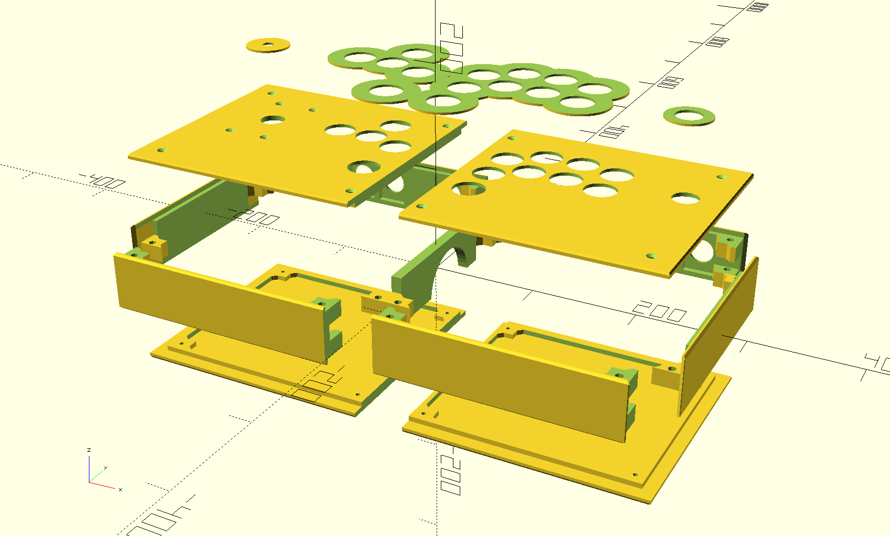

# The Buildable Stick System

Files for 3D printing an arcade stick.

[OpenSCAD-based illustration of how the components for an overhang panel-based stick fit together.]

[Photo of a completed inset panel-based stick.]

Originally an attempt to make a couple customized STL files for the [OpenStickCommunity Fightstick
Case](https://github.com/OpenStickCommunity/Hardware/tree/main/Fightstick%20Case), the changes ballooned to fit my
design and became incompatible with that project's components. This should be considered a different project with some
similar DNA, but to stress again, it could not have been done without that project as a guide star. See **Attribution**.

## Designing

No particular arcade stick design is prescribed by this project, instead, SCAD files are provided to choose desired
component objects or create new ones. The OpenSCAD language is essentially a functional programming language, making it
it easy to reuse, alter, and compose objects. If you do not see the object you would like, you can likely create it by
starting with an existing object and constructing what you'd like with new or existing components.

## Usage of Parts

There are a lot of parts to pick from, but there are some structural variants to pay attention to; here's some help
about when/how to use specific parts:

* `foo-panel-inset`s --- these fit flush into a frame, creating a closed box enclosure.
* `foo-panel-overhang`s --- these have a tray that fits into a frame with the actual face extending beyond the frame,
  creating an ice cream sandwich enclosure.
    * These also yield a bit more space inside the box, for tall levers or whatever.
* `frame`s (non-pieces) --- these create the box of the enclosure, as one part. These can be hard to print well ---
  shrinkage forces tend to curl up the corners no matter what you do, and some points need supports --- but if you don't
  care about that because you're printing an ice cream sandwich, they are simpler than...
* `frame-piece`s --- these break up the frame box into four faces, and are held together by friction fit and the hex
  bolts. This is more stable than you might expect, but it does introduce some variability in the overall sturdiness of
  the enclosure compared with the frame as one box piece.
    * The `interconnect` replaces the need to bolt multiple frames together.

## Printing

These items all fit on a 256mm^2 print bed; I use a Bambu Lab P1P based on what I've learned from the
OpenStickCommunity. Standard settings seem sufficiently sturdy for my purposes, though the slicer has done a couple
weird things, in my experience.

My preferred settings are 3 wall loops with 20% gyroid sparse infill. This gives the models a bit more weight and
stability, but something like 2 wall loops, 15% grid sparse infill is fine and does not lead to a weak enclosure. The
costs below have been made against my settings.

## Assembling

What you'll need beyond these objects:

* An arcade stick board (I recommend [TheTrain's RP2040 Advanced Breakout
  Board](https://github.com/OpenStickCommunity/Hardware/tree/main/RP2040%20Advanced%20Breakout%20Board))
    * 4 M3 8mm hex bolts to secure the PCB to a panel
* Per frame and plate combo:
    * 4 45mm M4 hex brass standoffs (or equivalent)
    * 8 M4 countersunk hex bolts
        * Overhang plates should use 12-16mm length bolts since they are taller
        * Inset plates should probably use 8-12mm bolts --- some standoffs aren't threaded the whole way, making 16mm
          too long to go flush
        * If making the 45mm standoffs from multiple smaller ones, make sure they have enough length to take your bolts!
* Per frame connection point:
    * 8 16mm M4 bolts
    * 8 M4 flange nuts
* For a lever:
    * 4 12-16mm M4 countersunk hex bolts
    * 4 M4 flange nuts
* For Neutrik D connections:
    * 2 10mm M3 hex bolts
    * 2 M3 flange nuts
* Buttons and levers as desired
* Wiring as required

## Rough Costs

This is a rough estimate of the cost to produce one of these sticks, assuming a usual 2-frame design and layout.
Filament masses from Bambu Studio estimates, using Bambu PLA Basic.

* Left and right frame: **$10.42 USD** (208.50g each, as of 2024-02-22)
* Left and right (inset) top panels: **~$6.40 USD** (~128g each, as of 2024-02-22)
* Left and right (non-overhang) bottom panels: **$6.80 USD** (135.99g each, as of 2024-02-22)
* Miscellaneous mounting plates, decorative plates, etc.: **~$1.83 USD** (~73g, as of 2024-02-22)
* 8 16mm M4 bolts to connect the frames: **$0.72 USD** (you can get a pack of 100 on Amazon for $9, as of 2023-09-12)
    * These are only necessary if you are using the whole frames, but as a heads up, the material cost of the
      pieces-based interconnect piece costs around $1, so it's roughly a wash since that's also a frame wall.
* 8 M4 flange nuts to connect the frames: **$0.68 USD** (you can get a pack of 100 on Amazon for $8.50, as of 2023-09-12)
* 4 10mm M3 bolts to connect Neutrik D plates to frames: **$0.40 USD** (you can get a pack of 100 on Amazon for $10, as
  of 2023-09-12)
* 4 M3 flange nuts to connect Neutrik D plates to frames: **$0.34 USD** (you can get a pack of 100 on Amazon for $8.50,
  as of 2023-09-12)
* 8 45mm M4 spacers to connect panels to frames: **$2.40 USD** (you can get a pack of 10 on AliExpress for $3, as of
  2023-09-12)
    * You could 3D print these too, but you're probably better off with brass ones as they give some weight to the
      stick anyway
    * You can also use a shorter length with longer bolts, or combine multiple spacers, if either of those yield better
      prices
* 8 16mm M4 bolts to connect top plates to frames: **$0.72 USD** (you can get a pack of 100 on Amazon for $9, as of
* 8 12mm M4 bolts to connect bottom plates to frames: **$0.72 USD** (you can get a pack of 100 on Amazon for $9, as of
  2023-09-12)

With an enclosure coming in around $31, depending on your choices --- say, ~$30 for TheTrain's RP2040 Advanced Breakout
Board, ~$60 for Sanwa buttons and a lever, and ~$20 for miscellaneous connectors and wiring --- you can put a
full-featured controller with an open source foundation together for around $140. Reducing wall and infill settings
will probably save you around $5 of material, and you can probably decide what you want to do from there.

## Miscellany

See the `/docs/` directory for more thoughts too scattered for this document.

## Issues and Limitations

This is a living repository, and as such, there are likely issues with the objects, known or otherwise.
These issues may be fixed in the future; see `TODO.md` for details.

## Development and Contributing

Improvements, variants, new layouts, novel ideas, and etc. are all welcome.

These files are suitable for previewing and rendering in OpenSCAD. They may also work in FreeCAD and perhaps other
software, but they are developed in OpenSCAD, so YMMV otherwise.

This project is hosted at [my personal Git site](https://git.incorporeal.org/bss/buildable-stick-system), but people are
more likely to want to interact with [the GitHub mirror](https://github.com/bsstephan/buildable-stick-system). Feel free
to use either.

I'm reachable on the fediverse, over email, or on Discord, but if you're looking for an option I prefer, I maintain an
IRC channel, `#buildable-stick-system`, on [my IRC network, Randomus](https://randomus.net/) if you would like a place
to hang out and discuss issues and features and whatnot.

## Attribution

Inspired by the incredible work of [TheTrain](https://github.com/TheTrainGoes) on the [OpenStickCommunity Fightstick
Case](https://github.com/OpenStickCommunity/Hardware/tree/main/Fightstick%20Case), itself based on the incredible work
by [Dash n'Mash](https://twitter.com/Dash_xx_Mash?s=20). Original work Copyright 2023 TheTrain, [licensed under CC BY
4.0](https://creativecommons.org/licenses/by/4.0/).

Made possible by the amazing efforts of [slagcoin](https://www.slagcoin.com/).

## Author and Licensing

Written by and copyright Brian S. Stephan (<bss@incorporeal.org>).

The Buildable Stick System is free software: you can redistribute it and/or modify it under the terms of the GNU General Public
License as published by the Free Software Foundation, either version 3 of the License, or (at your option) any later
version.

The Buildable Stick System is distributed in the hope that it will be useful, but WITHOUT ANY WARRANTY; without even the implied
warranty of MERCHANTABILITY or FITNESS FOR A PARTICULAR PURPOSE. See the GNU General Public License for more details.

You should have received a copy of the GNU General Public License along with the Buildable Stick System. If not, see
<https://www.gnu.org/licenses/>.
